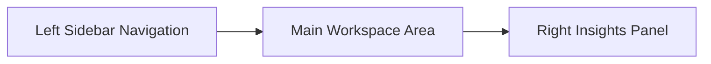

# User Guide — JobOrbit Application

Welcome to **JobOrbit**, a local-first, offline-native job application tracker. This guide describes each user interface element and its function to help you manage your career search efficiently.

---

## 1. Shell & Layout Navigation

### A. Left Navigation Sidebar
Located on the far left edge of the page, this panel manages your application state and global navigation.
* **Header Collapse Button (`ChevronLeft` / `ChevronRight`)**: Click this to collapse the sidebar into a compact, space-saving icon-only view (`76px` wide) or expand it back to full size (`260px`).
* **Navigation Links**:
  * **Dashboard**: Accesses key summaries, pending items, and activity feeds.
  * **Kanban Board**: Opens the interactive drag-and-drop stage visualizer.
  * **Calendar**: Displays a monthly grid showing deadlines and reminder notifications.
  * **Analytics**: Charts funnel progression and priority distributions.
  * **Contacts**: Lists recruiters, hiring managers, and references.
* **Pill Active Highlight**: The currently selected view is marked with a rounded background pill using your brand colors. All navigation icons are vertically aligned.
* **Theme Switcher (`Moon` / `Sun` Icon)**: Located in the sidebar footer. Click to toggle between **Light Mode** and a sleek, low-contrast **Dark Mode** configuration.

### B. Right Insights & Alerts Panel
Located on the right side of the screen, this panel displays real-time statistics and upcoming reminders.
* **Quick Stats Cards**:
  * **Active Applications**: Total count of non-archived job files.
  * **Interviewing Stages**: Count of jobs in recruiter screen, technical assessment, or interview stages.
  * **Pending Tasks**: Count of uncompleted job search checklists.
* **Alerts & Actions Feed**: Lists upcoming deadlines and follow-up reminders.
  * **Mark Read (`Check` button)**: Clears the reminder card from the active feed.
  * **Snooze (`Clock` button)**: Postpones the notification alert for 10 minutes.
  * **Delete (`Trash` button)**: Permanently removes the reminder entry.
* **Collapse Header (`ChevronRight`)**: Closes the insights panel to maximize the center horizontal grid area.
* **Floating Sparkles Button**: When the insights panel is collapsed, this floating button appears in the top-right corner. Click it to expand and restore the panel.

---

## 2. Main Workspace Views

### A. Dashboard View
* **Local Greeting**: Greets you dynamically based on your system clock (e.g. *Good Morning ☀️*, *Good Afternoon 🌤️*, *Good Evening 🌙*).
* **Summary Row**: High-level counters displaying active cards, interviews, offers, and task completions.
* **Today's Tasks Checklist**: A scrollable task list. Toggle checkbox buttons to mark items as complete. Red labels indicate overdue items.
* **Recent Activity Feed**: An audit log showing status changes (e.g., *Job moved from Applied to Offer*), logged with notes and timestamps.

### B. Kanban Board
The main interface for tracking active applications through different application stages.
* **Search Input**: Text field to search applications by title, company name, location, or notes. Click the `X` button on the right edge to clear input immediately.
* **Dropdown Filters**:
  * **Priority**: Filter cards by priority level (*High*, *Medium*, *Low*).
  * **Employment Type**: Filter by job model (*Full-time*, *Part-time*, *Contract*, *Freelance*, *Internship*).
  * **Location**: Search and filter by job location tags.
  * **Clear Filters Button**: Appears when filters are active to reset them in one click.
* **Board Columns**: Rendered dynamically based on application statuses. Each column displays a count badge and scrolls vertically to manage cards.
* **Drag-and-Drop system**:
  * **Drag Overlay Clone**: Grabbing a card creates a full-fidelity floating clone directly under the cursor.
  * **Placeholder**: The card's original slot turns into a dashed outline at `0.3` opacity.
  * **Drop Target Glow**: Hovering over a column highlights it with a primary color outline and a soft brand glow shadow.
* **Job Card Elements**:
  * **Title link**: Click directly on the title to open the edit drawer. Clicks are protected to prevent accidental drag triggers.
  * **Priority Badges**: Color-coded indicators (*Red* for High, *Orange* for Medium, *Blue* for Low).
  * **Duplicate Warnings (`AlertTriangle` icon)**: Appears if you have another active application for the same job title at the same company.

### C. Calendar View
* **Month Grid Navigation**: Jump between months using the navigation header.
* **Calendar Cells**: Group dates chronologically, displaying colored dots for:
  * Application dates (`Blue` dots).
  * Task due dates (`Orange` dots).
  * Reminders (`Red` dots).
* **Interactive Day Modals**: Click on any date cell to view detailed events or open linked job cards directly.

### D. Analytics Dashboard
* **Funnel Progress Chart**: Visualizes conversion rates from initial contact to offer stages.
* **Active Applications Bar Chart**: Tallies how many applications are currently in each column.
* **Priority Pie Chart**: Breaks down your active queue by priority level.

---

## 3. Detail & Management Controls

### A. Quick Add Button (FAB)
The floating blue circular button (`Plus` icon) is always available in the bottom-right corner. Click it to open the creation modal from any view.

### B. Quick Add Modal
A standardized dialog containing:
* Required text inputs (Company, Job Title, Application Status).
* Optional metadata dropdowns (Priority, Location, URL, Salary Range).
* Click **Create Application** to save the entry to IndexedDB, which updates all views instantly.

### C. Slide-out Job Details Drawer
Clicking a job card title opens this panel from the right edge.
* **Header Actions**:
  * **Archive Icon**: Toggles the archived state, removing cards from the active Kanban board without deleting historical data.
  * **Trash Icon**: Prompts to permanently delete the application.
  * **Close Icon (`X`)**: Slides the drawer shut.
* **Timeline Audit Tab**: Shows the timeline of status modifications, including logged notes.
* **Notes & Status Transitions**: Allows you to change the status of an application and enter a status transition note.
* **Subtask Checklist**: Create subtasks linked to this application. Subtasks checkmarks are linked to your global dashboard calendar.
